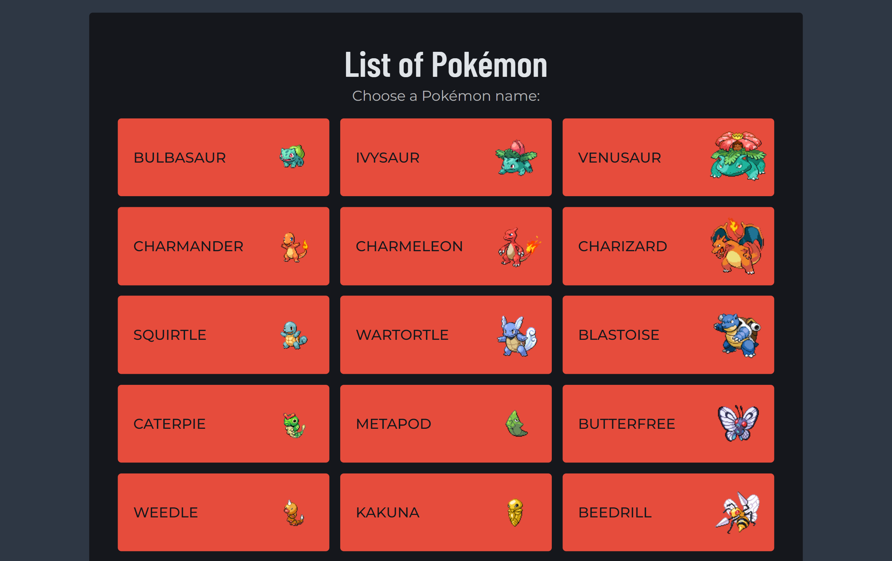
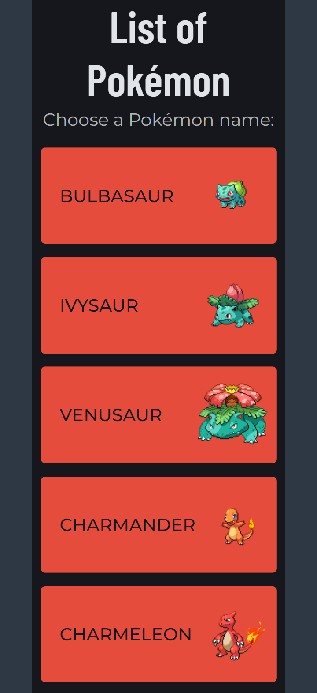
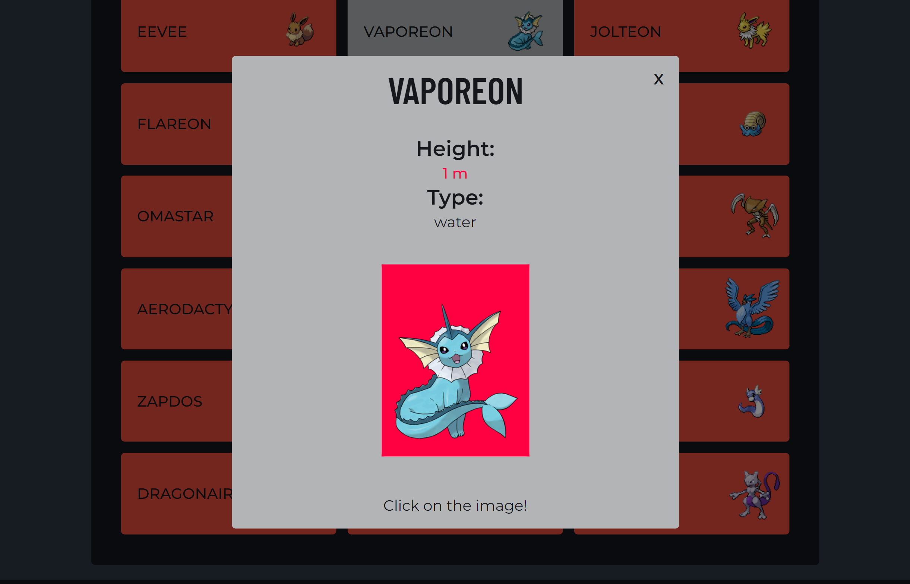

# JavaScript App (Pokédex)

## Table of contents

-   [Introduction](#introduction)
-   [Screenshots to represent the project](#screenshots-to-represent-the-project)
-   [Overview](#overview)
-   [Link to the App](#link-to-the-app)
-   [Technologies](#technologies)
-   [Libraries](#libraries)
-   [References](#references)

### Introduction

The aim of this project was to create a small, responsive Pokédex web application, that loads data from an external public Pokémon API and enables the viewing of data points of Pokémon in detail. The project itself was built with HTML, CSS and JavaScript.

All Pokémon data loaded from [https://pokeapi.co/](https://pokeapi.co/).

Many thanks go to **Amit Mondal** for his card flip animation, which has been implemented in the project. You can find his animation in the **References** section.

### Screenshots to represent the project

### Overview

-   application was coded in HTML/CSS/SCSS/JS, but Bootstrap has been implemented as well (specially for the automated carousel and search bar).
-   all Pokémon data loaded from [https://pokeapi.co/](https://pokeapi.co/)
-   the app contains all together 150 Pokémon
-   clicking on a single Pokémon resulting more detailed information
-   clicking on a Pokémon image inside the card reveals another image of the Pokémon

### Link to the App

A link to the live, hosted version of the app:

[https://seresbeata.github.io/achievement-2/](https://seresbeata.github.io/achievement-2/)

### Technologies

The following technologies were used:

-   HTML5
-   CSS3, such as CSS Grid Layout and CSS Flexbox Layout
-   Sass, SCSS-Syntax
-   Javascript ES6

### Libraries

The following libraries were used:

-   Bootstrap v5.3
-   Polyfill, for Fetch and Promise

### References

1.  Reference  
    Description: favicon generator  
    Product: favicon.ico  
    Date: 16/09/2023  
    [https://favicon.io/](https://favicon.io/)

2.  Reference  
    Description: SVG file  
    Product 1: 211904_social_github_icon.svg  
    Product 2: 1392682_cinema_film_game_go_movie_icon.svg  
    Product 3: 5305157_connection_linkedin_network_linkedin_logo_icon.svg  
    Product 4: 1337449_bulbasaur_go_pokemon_game_play_icon.svg  
    Product 5: 1337469_eevee_go_pokemon_game_play_icon.svg  
    Product 6: 1337476_go_jigglypuff_pokemon_game_play_icon.svg  
    Product 7: 1337496_game_go_pidgey_play_pokemon_icon.svg  
    Product 8: 1337497_game_go_play_pikachu_pokemon_icon.svg  
    Product 9: 1337514_game_go_play_pokemon_rattata_icon.svg  
    Date: 13/09/2023  
    [https://www.iconfinder.com/](https://www.iconfinder.com/)

3.  Reference  
    Description: source code  
    Title: Card flip onClick  
    Author: **Amit Mondal**  
    GitHub: [https://github.com/mondal10](https://github.com/mondal10)  
    Date: 9/09/2023  
    Availability: [https://codepen.io/mondal10/pen/WNNEvjV](https://codepen.io/mondal10/pen/WNNEvjV)

4.  Reference  
    Description: RESTful Pokémon API  
    Title: PokéApi  
    Author: **Paul Hallett, Zane Adickes, Tim Malone, Mark Tse, Sargun Vohra, Charles Marttinen, Alessandro Pezzé, Alberto Oliveira da Silva, Lucio Merotta, Alessandro Pezzé, Hoang Quoc Trung, Chandler Mahkorn, André Sousa, Alexander Whan, Austin Jones, tomi-912, Eric Donders, Gaël Dottel, Parnassius, Anh Thang**  
    Availability: [https://pokeapi.co/](https://pokeapi.co/)
